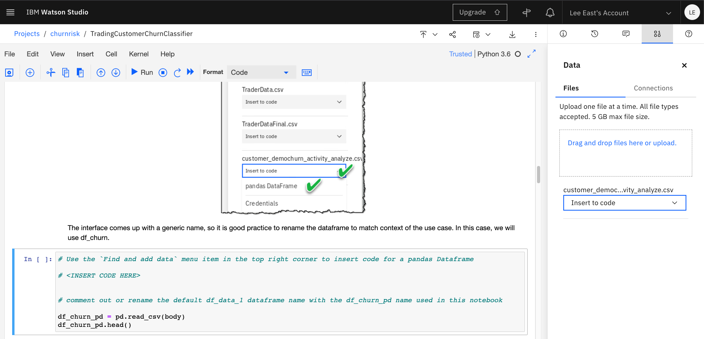
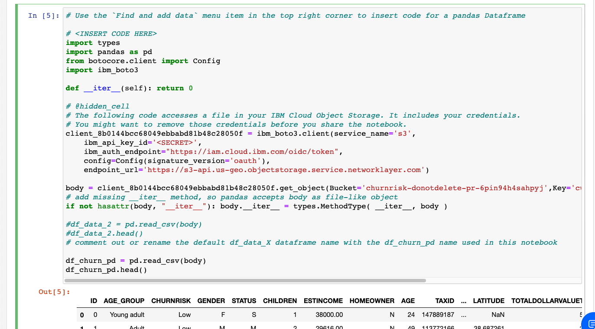
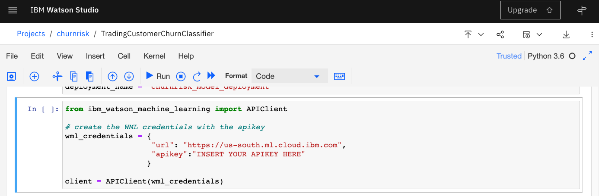
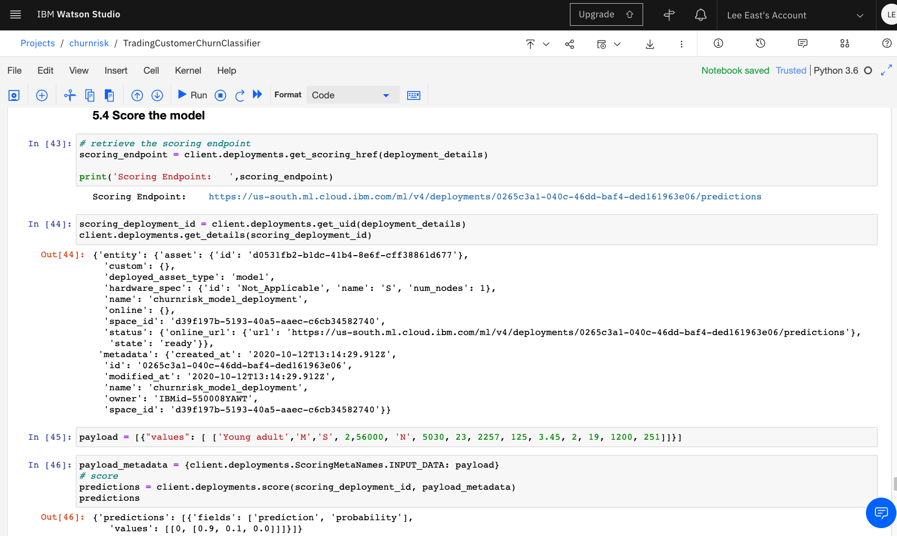
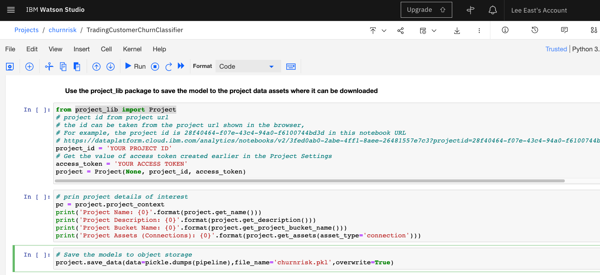

# Model Deployment with IBM Watson Studio and Watson Machine Learning.

How do you get value from AI models?   By deploying and infusing them into applications.


### Introduction

IBM Watson Studio and Watson Machine Learning are available on the IBM Cloud and those components are also integrated with the IBM Cloud Pak for Data (CP4D).   They can be used to develop AI models and deploy them.   This project outlines how to do this in the IBM Cloud but the process is also applicable to where ever you are running CP4D.

### Pre-requisites

- Open an [IBM Clound account](https://www.ibm.com/cloud) or sign-in.
- Add several services; Cloud Object Storage, Watson Studio, and Watson Machine Learning. 
- Create an API key. 

The services are available with Lite (free) options to help you get started.


The API key can be created by navigating the top menu `Manage -> Access (IAM)`


You can only see the key value at creation time.   Save the key value in a safe place.  We will use it when creating an APIClient.

### Project Setup

Start by cloning this project on your desktop and changing to the churnrisk directory.

`git clone https://github.com/jvanoosten/churnrisk.git`

`cd churnrisk`

Now go to the IBM Cloud and start at Resource List screen, select the Watson Studio service and push the `Get Started` button.


Use the Quick Navigation link to go to the `Deployment spaces` and select the option  For a name, specify `churnrisk_deployment_space`.  Select the cloud object storage and watson machine learning services that you want associated with the space.    


 
Use the Quick Navigation link in Watson Studio to go to the `Projects`.

Create a new empty project call `churnrisk` and select your cloud object storage to be used by the project. 


Projects include Assets like datasets and notebooks, Environments like notebook runtime environments with Python, Jobs that can be scheduled, Access Control for controling collaborator authorizatoins, and Settings.

Within the project `Settings`, create a new `Access token` called `churnrisk_access_token`.  This token will be used in a notebook to save files to the project.  


This token will be used in a notebook to save files to the project.  The value of the token can be viewed at anytime using the view option for the token.


Highlight the token to copy it. 


### Add the Dataset and Notebook Assets to the Project

You can add Assets to the project using blue `Add to project +` button at the top of the project.   We want to add the Within the projects `Assets`, 


#### Add dataset

Add a dataset to the project by selecting the `Data` button.Add a dataset asset to your project.  You can use the browse button or drag and drop to upload the `customer_demochurn_activity_analyze.csv` included in the churnrisk github project.

#### Add notebook

Use the `Add to project` menu option and select the `Notebook` as the asset type.  Create the new notebook by using the `From file` option.  Drag and drop the `TradingCustomerChurnClassifier.ipynb` file to upload it. 


Press complete to create the notebook.   An Python36 environment will be created and the notebook will be ready to execute.   

### Execute the notebook

The TradingCustomerChurnClassifier notebook 


The notebook 

1. Ingest merged customer demographics and trading activity data
2. Visualize merged dataset and get better understanding of data to build hypotheses for prediction
3. Leverage sklearn library to build classification model that predicts whether customer has propensity to churn
4. Expose the classification model as RESTful API endpoint for the end-to-end customer churn risk prediction and risk remediation application

You can execute the notebook cells using the widgets at the top of the page or by pressing `Shift-Enter`.

#### Load Data 

The code to load the dataset is inserted in the notebook by using the data wizard. 



After insert:



#### Save the model to the deployment space

The model is deployed online by following these steps:

1. Lookup the pre-created deployment space.
2. Set this deployment space as the default space.
3. Store the model pipeline in the deployment space. Enter the name for the model in the cell below.
4. Deploy the saved model. Enter the deployment name in the cell below.
5. Retrieve the scoring endpoint to score the model with a payload

The ibm_watson_machine_learning library is used to complete these steps.

You need to insert your API key to create the APIClient. 



After the model is saved and deployed online, it can be scored (called to make predictions).



#### Useful helper functions 

A `create_download_link_csv` function is defined that can be used to create a download dataset button within the notebook. 

Examples are included showing how to save and restore the model using two different packages: joblib and pickle.

Finally, the project_lib package is used to save `churnrisk.pkl` to the project data assets.  The serialized model can be downloaded from the project to be used in application.  



The project id can be found in the URL for the notebook.  The ID starts after `projectid=` and ends before the `&`.  The project id is `13f6e435-488e-4f71-97a0-3a4abd877587` in this example.

`https://dataplatform.cloud.ibm.com/analytics/notebooks/v2/87df1173-28a4-4040-80cb-ad1ad5832fb2?projectid=13f6e435-488e-4f71-97a0-3a4abd877587&context=cpdaas`

The Access Token was created earlier in Project Settings. 

### Execute the churnrisk applications on your workstation 

#### Execute the churnrisk_app.py 

The churnrisk_app.py uses the APIClient from the ibm_watson_machine_learning to call the deployed model similar to example in the notebook.

The `python churnrisk_app.py -h` command show the help.  

```
usage: churnrisk_app.py [-h] -a A -s S -d D -p P [-l L]
churnrisk_app.py: error: the following arguments are required: -a, -s, -d, -p

Where:
  -a A        API key
  -s S        space name
  -d D        deployment name
  -p P        payload
  -l L        logging level (optional)
```

Sample command:

`python churnrisk_app.py -a YOUR_API_KEY -s churnrisk_deployment_space -d churnrisk_model_deployment -p '{"input_data":[{"fields":["AGE_GROUP","GENDER","STATUS","CHILDREN","ESTINCOME","HOMEOWNER","TOTALDOLLARVALUETRADED","TOTALUNITSTRADED","LARGESTSINGLETRANSACTION","SMALLESTSINGLETRANSACTION","PERCENTCHANGECALCULATION","DAYSSINCELASTLOGIN","DAYSSINCELASTTRADE","NETREALIZEDGAINS_YTD","NETREALIZEDLOSSES_YTD"],"values":[["Adult","F","M",2,25000,"N",5000,50,500,50,3.45,3,10,1500.0,0.0]]}]}'`

Produces this output:

```
deployment space:  churnrisk_deployment_space , id:  d39f197b-5193-40a5-aaec-c6cb34582740
deployment id:  e7946bcb-af93-440a-a465-b685d54681aa
deployment details:  {'entity': {'asset': {'id': 'b02304e3-2b21-448e-83f7-7f01f0554b34'}, 'custom': {}, 'deployed_asset_type': 'model', 'hardware_spec': {'id': 'Not_Applicable', 'name': 'S', 'num_nodes': 1}, 'name': 'churnrisk_model_deployment', 'online': {}, 'space_id': 'd39f197b-5193-40a5-aaec-c6cb34582740', 'status': {'online_url': {'url': 'https://us-south.ml.cloud.ibm.com/ml/v4/deployments/e7946bcb-af93-440a-a465-b685d54681aa/predictions'}, 'state': 'ready'}}, 'metadata': {'created_at': '2020-10-11T14:48:21.895Z', 'id': 'e7946bcb-af93-440a-a465-b685d54681aa', 'modified_at': '2020-10-11T14:48:21.895Z', 'name': 'churnrisk_model_deployment', 'owner': 'IBMid-550008YAWT', 'space_id': 'd39f197b-5193-40a5-aaec-c6cb34582740'}}
payload:  {'input_data': [{'fields': ['AGE_GROUP', 'GENDER', 'STATUS', 'CHILDREN', 'ESTINCOME', 'HOMEOWNER', 'TOTALDOLLARVALUETRADED', 'TOTALUNITSTRADED', 'LARGESTSINGLETRANSACTION', 'SMALLESTSINGLETRANSACTION', 'PERCENTCHANGECALCULATION', 'DAYSSINCELASTLOGIN', 'DAYSSINCELASTTRADE', 'NETREALIZEDGAINS_YTD', 'NETREALIZEDLOSSES_YTD'], 'values': [['Adult', 'F', 'M', 2, 25000, 'N', 5000, 50, 500, 50, 3.45, 3, 10, 1500.0, 0.0]]}]}
{'predictions': [{'fields': ['prediction', 'probability'],
                  'values': [[2, [0.3, 0.3, 0.4]]]}]}
```
The prediction is shown at the bottom of the output.

#### Execute the churnrisk_localmodel.py application 

The `churnrisk_localmodel.py` loads the `churnrisk.pkl` file using pickle.load() method.  The `churnrisk.pkl` was created in the notebook using pickle.dump() method and saved in the project data a0ssets using the `project_lib` package.  A version of the `churnrisk.pkl` is included in the github project.  The file can also be downloaded from the project. 

Run: 
`python churnrisk_localmodel.py`

The application output:

```
load the churnrisk.pkl using pickle.load()
evaluate the loaded model using the model_eval.csv file.
predictions:  [1 0 0 0 0 2 2 1 1 1 1 0 0 0 0 1 0 0 0 0 0 0 1 0 0 0 1 0 1 2 0 1 2 2 0 1 0
 0 0 0 2 2 0 2 2 1 2 1 1 0 0 0 0 1 1 1 1 1 0 1 0 0 1 0 0 1 2 0 0 1 0 2 0 0
 0 0 1 1 2 0 0 0 0 2 0 0 1 1 0 0 1 0 1 1 1 1 1 0 0 0 1 2 2 0 0 1 0 0 2 0 1
 0 2 0 1 1 1 0 0 1 0 1 0 0 0 1 1 0 0 0 1 0 1 0 2 2 0 0 0 1 0 1 2 0 0 0 1 0
 0 0 1 0 0 0 1 0 0 1 1 0 0 1 0 0 0 0 2 0 0 2 0 2 1 0 1 0 1 1 2 0 0 0 0 0 2
 1 0 2 1 0 0 1 2 2 1 1 0 1 0 0 2 0 0 1 0 2 2 1 0 0 1 1 0 0 0 1 1 0 0 0 2 1
 1 0 1 0 1 2 1 0 0 0 0 1 0 0 2 0 1 1 1 0 0 0 1 1 0 1 0 0 0 0 2 2 1 0 0 0 1
 2 0 1 0 0 0 0 0 1 0 2 1 1 1 1 0 0 0 2 1 0 1 1 0 1 0 0 1 0 0 1 1 1 0 1 0 0
 0 1 0 1 1 1 2 1 0 0 1 1 0 1 0 0 0 0 1 1 0 1 0 2 0 0 0 1 1 0 0 0 1 1 0 2 1
 0 1 1 0 0 0 0 0 1 0 0 0 1 1 0 1 2 0 1 1 1 0 2 0 0 2 1 0 0 0 0 0 0 0 0 2 1
 1 0 2 2 2 0 2 1 1 0 0 0 0 1 0 0 0 1 0 1 2 1 0 2 0 0 1 2 0 0 1 1 1 0 1 0 0
 1 1 0 2 2 0 0 1 0 0 0 0 0 1 2 2 1 1 1 2 1 0 0 1 1 1 0 1 0 0 1 0 0 0 1 1 0
 2 0 1 0 0 0 0 2 0 1 1 1 0 2 1 2 2 0 1 2 0 2 0 1 2 0 2 0 0 0 0 1 0 0 1 0 0
 2 1 2 0 0 2 2 1 0 2 1 0 0 0 2 0 0 1 0 0 0 1 0 0 0 0 0 0 1 0 0 2 0 0 2 0 0
 1 2 1 2 0 0 1 1 0 0 1 1 0 2 1 2 1 1 0 2 0 0 0 0 1 0 0 0 0 0 2 0 0 0 0 0 1
 0 1 0 0 1 0 1 1 1 1 1 0 2 0 2 1 0 2 1 1 2 0 1 0 2 0 0 1 2 0 0 0 1 0 1 0 0
 0 0 0 0 1 0 1 1 0 1 0 0 0 1 0 0 0 0 0 0 1 0 1 0 0 0 1 1]
model accuracy:  0.9387096774193548
make a single prediction using a dataframe payload
prediction:  [2]
```


### Run an AutoAI experiment  

Select the dataset 
Select churnrisk as the prediction field
When the AutoAI completes (or you stop it early), select the top pipeline to add to the deployment space.

Go to the deployment space to deploy the model. 

Test the deployed model.

Here is a sample payload you can use to test the AUTO AI deployed model.
```
 {"input_data":[{"fields":["ID","AGE_GROUP","GENDER","STATUS","CHILDREN","ESTINCOME","HOMEOWNER","AGE","TAXID","CREDITCARD","DOB","ADDRESS_1","ADDRESS_2","CITY","STATE","ZIP","ZIP4","LONGITUDE","LATITUDE","TOTALDOLLARVALUETRADED","TOTALUNITSTRADED","LARGESTSINGLETRANSACTION","SMALLESTSINGLETRANSACTION","PERCENTCHANGECALCULATION","DAYSSINCELASTLOGIN","DAYSSINCELASTTRADE","NETREALIZEDGAINS_YTD","NETREALIZEDLOSSES_YTD"],"values":[[1,"Adult","F","M",None,None,None,None,None,None,None,None,None,None,None,None,None,None,None,None,None,None,None,None,None,None,None,None]]}]}
    predictions = client.deployments.score(scoring_id, payload)
```

From your desktop, run the churnrisk_autoai.py application to call the churn risk predictor that is running in the cloud.
```
python churnrisk_autoai.py -l INFO -a <YOU APIKEY> -s <DEPLOYMENT SPACE NAME> -d "DEPLOYMENT NAME" -p <PAYLOAD>
```


From your desktop, run the churnrisk_location.py application to load and score the model that was saved. 

`python churnrisk_localmodel.py`


